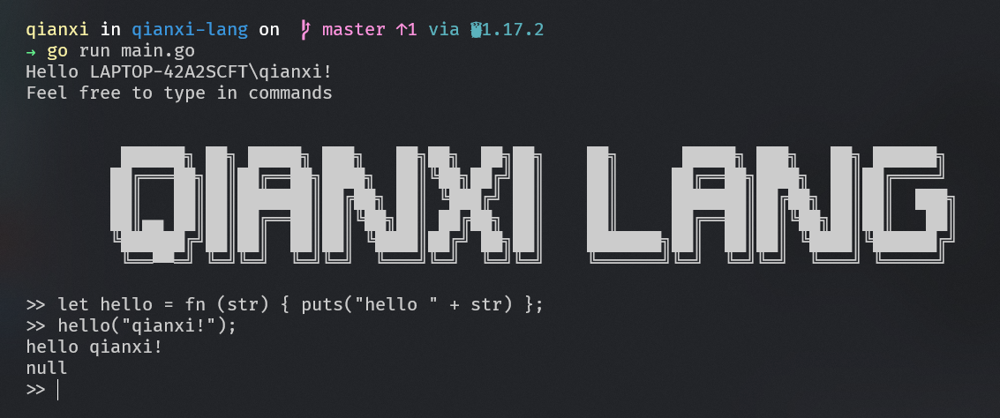

# qianxi-lang

> a lang interpreter written in go

## Try

### Download

```bash
git clone https://github.com/qianxi0410/qianxi-lang

cd monkey-lang
```

### with REPL

```bash
go run main.go
```



### with File Interpreter

```bash
go run .\main.go filepath
```

## Documetion

### Summery

*   C-like syntax
*   variable bindings
*   numbers and booleans 
*   a string data structure
*   an array data structure
*   a hash data structure
*   arithmetic expressions
*   built-in functions
*   first-class and higher-order functions • closures
*   logic operator

### Keywords

`let` 、 `fn` 、 `if` 、 `else` 、 `elif` 、 `return` 、 `true` 、 `false`

### Examples

#### let

```c
let <identifier> = <value>;

let a = 1;
let b = 2.2;
let c = "hello world";
let d = true;
```

#### fn

```c
let fibonacci = fn(x) { 
    if (x <= 1) { 
        x
    } else { 
        fibonacci(x - 1) + fibonacci(x - 2);
    } 
};
```

#### if

```c
let hello = if (x == 1) {
        "hello world"
    } elif (x == 2) {
       "hello qianxi"
    } else {
       "just hello"
    }

```

#### return

```c
let identity = fn(x) {
  return x;
};

identity("qianxi");
```

#### operators

```c
1 + 2 + (3.3 * 4) - (10 / 5);
!true;
!false;
+10;
-5;
"Hello" + " " + "World";
1 && 2;
1 || 2;
1 << 2;
2 >> 1;
1 & 2;
1 | 2;
1 ^ 2;
~1;
```

#### Built-in Structs

##### array

```bash
let arr = [<expression>, <expression>, ...];

let arr = [1, 2, 3 + 3, fn(x) { x }, add(2, 2), true];

arr[0];
arr[1];
```

##### hash

```c
let h = { <expression>: <expression>, <expression>: <expression>, ... };

let hash = {
  "name": "qianxi",
  "age": 21,
  true: "a boolean",
  99: "an integer"
};

hash["name"];
hash["a" + "ge"];
hash[true];
hash[99];
hash[100 - 1];
```

#### Built-in Functions

🚀 `qianxi lang` provide you some built-in functions

##### len

```c
len(<array | string>): number;

len([1, 2, 3]); // 3
len("hello"); // 5
```

##### first

```bash
first(<array>): any;

first(["hello", 2, 3]); // "hello"
first([1, 2, 3]); // 1
```

##### last

```c
last(<array>): any;

first(["hello", 2, 3]); // 3
first([1, 2, "qianxi"]); // "qianxi"
```

##### rest

```c
rest(<array>): array;

rest([]) // NULL
rest([1]) // []
rest([1, 2, 3]) // [2, 3]
```

##### push

```c
push(<array>): array
    
push([], 1) // [1]
```

##### puts

```c
puts(<any>): NULL
    
puts("hello world") // print : hello world
```

## Licence

[MIT](./LICENSE)
